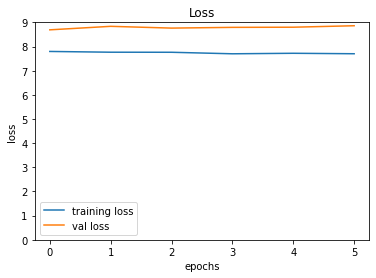
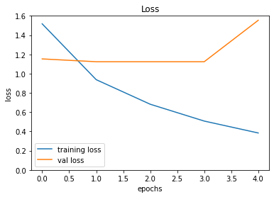

<div style="position: absolute; top: 0; right: 0;">
    <a href="ertugrulbusiness@gmail.com"></a>
    <a href="https://tr.linkedin.com/in/ertu%C4%9Fruldemir?original_referer=https%3A%2F%2Fwww.google.com%2F"></a>
    <a href="https://github.com/ertugruldmr"></a>
    <a href="https://www.kaggle.com/erturuldemir"></a>
    <a href="https://huggingface.co/ErtugrulDemir"></a>
    <a href="https://stackoverflow.com/users/21569249/ertu%c4%9frul-demir?tab=profile"></a>
    <a href="https://medium.com/@ertugrulbusiness"></a>
    <a href="https://www.youtube.com/channel/UCB0_UTu-zbIsoRBHgpsrlsA"></a>
</div>

# NLP Question Answering
 
## __Table Of Content__
- (A) [__Brief__](#brief)
  - [__Project__](#project)
  - [__Data__](#data)
  - [__Demo__](#demo) -> [Live Demo]()
  - [__Study__](#problemgoal-and-solving-approach) -> [Colab]()
  - [__Results__](#results)
- (B) [__Detailed__](#Details)
  - [__Abstract__](#abstract)
  - [__Explanation of the study__](#explanation-of-the-study)
    - [__(A) Dependencies__](#a-dependencies)
    - [__(B) Dataset__](#b-dataset)
    - [__(C) Modelling__](#e-modelling)
    - [__(D) Deployment as web demo app__](#g-deployment-as-web-demo-app)
  - [__Licance__](#license)
  - [__Connection Links__](#connection-links)

## __Brief__ 

### __Project__ 
- This is an __question answearing__  project that uses the  [__squad dataset__](https://huggingface.co/datasets/squad) to __answer question__ from given text.
- The __goal__ is build a deep learning deep learning model that accurately __answer question__ from given text. 
- The performance of the model is evaluated using several __metrics__ loss and accuracy metrics.

#### __Overview__
- This project involves building a deep learning model to answer the questions from given context text. Stanford Question Answering Dataset (SQuAD) is a reading comprehension dataset, consisting of questions posed by crowdworkers on a set of Wikipedia articles. SQuAD2.0 combines the 100,000 questions in SQuAD1.1 with over 50,000 unanswerable questions written adversarially by crowdworkers to look similar to answerable ones. The models selected according to model tuning results, the progress optimized respectively the previous tune results. The project uses Python and several popular libraries such as Pandas, NumPy, tensorflow.

#### __Demo__

<div align="left">
  <table>
    <tr>
    <td>
        <a target="_blank" href="" height="30">[Demo app] HF Space</a>
      </td>
      <td>
        <a target="_blank" href="">[Demo app] Run in Colab</a>
      </td>
      <td>
        <a target="_blank" href="">[Traning pipeline] source on GitHub</a>
      </td>
    <td>
        <a target="_blank" href="">[Traning pipeline] Run in Colab</a>
      </td>
    </tr>
  </table>
</div>


- Description
    - __answer questions__ from context text.
    - __Usage__: write a context text then write a question related the contex text then use the button to answer your question.
- Embedded [Demo]() window from HuggingFace Space
    

<iframe
	src=""
	frameborder="0"
	width="850"
	height="450"
></iframe>

#### __Data__
- The [__squad dataset__](https://huggingface.co/datasets/squad) from tensorflow dataset api.
- Stanford Question Answering Dataset (SQuAD) is a reading comprehension dataset, consisting of questions posed by crowdworkers on a set of Wikipedia articles.
-  SQuAD2.0 combines the 100,000 questions in SQuAD1.1 with over 50,000 unanswerable questions written adversarially by crowdworkers to look similar to answerable ones.

#### Problem, Goal and Solving approach
- This is a __multiple text task__ problem  that uses the  [__squad dataset__](https://huggingface.co/datasets/squad) to __answer question__ from given text.
- The __goal__ is to build a model that accurately __answer question__ from given the context text.
- __Solving approach__ is that using the supervised deep learning models. A state of art model from huggingface fine-tuned. 

#### Study
The project aimed answer the questions which related with context text. The study includes following chapters.
- __(A) Dependencies__: Installations and imports of the libraries.
- __(B) Dataset__: Downloading and loading the dataset. Preparing the dataset via tensorflow and huggingface dataset api. Configurating the dataset performance and related pre-processes.
- __(C) Modelling__: It includes following subsections.
  - Archirecture
    - 'distilbert-base-cased' model architecture for TFAutoModelForQuestionAnswering task.
  - Training
    - Declerating the callbacks then training the hugging face model object using the prepared data with determinated hyperparams.
  - Predicting
    - Implementing the model on the example data, inferencing.
  - Evaluating
    - Saving the model architecture with weights.
- __(D) Deployment as web demo app__: Creating Gradio Web app to Demostrate the project.Then Serving the demo via huggingface as live.

#### results
- The final model is __distilbert-base-cased_QuestionAnswering__ because of the results and less complexity.
  - distilbert-base-cased_QuestionAnswering
        <table><tr><th> Results </th><th></th></tr><tr><td>
      |   | loss  | val_loss  |
      |---|-------|-------|
      |   | 0.3825 | 1.5389 | 
      </td></tr></table>


## Details

### Abstract
- [__squad dataset__](https://huggingface.co/datasets/squad) is used to answer the question which related contex text. The dataset is consisting of questions posed by crowdworkers on a set of Wikipedia articles. SQuAD2.0 combines the 100,000 questions in SQuAD1.1 with over 50,000 unanswerable questions written adversarially by crowdworkers to look similar to answerable ones. The problem is natural language problem which question ansering task. The goal is answering questions which related context text using  through supervised state of art deep learning algorithms via fine tuning or transfer learning. The study includes creating the environment, getting the data, preprocessing the data, exploring the data, configurating the data, tokenizating the data, adjusting the data notation, preprocesing the data, modelling the data, saving the results, deployment as demo app. Training phase of the models implemented through tensorflow callbacks. After the fine tuning 'distilbert-base-cased' state of art model traininigs, transfer learning and related approaches are implemented. Selected the basic and more succesful model which is the distilbert-base-cased_QuestionAnswering. Fine-Tuned __distilbert-base-cased__ model has __0.3825__ loss , __1.5389__ val loss,  other metrics are also found the results section. Created a demo at the demo app section and served on huggingface space.  


### File Structures

- File Structure Tree
```bash
├── demo_app
│   ├── app.py
│   ├── examples.pkl
│   ├── model_downloading_instructions.txt
│   └── requirements.txt
├── docs
│   └── images
├── env
│   ├── env_installation.md
│   └── requirements.txt
├── LICENSE
├── readme.md
└── study.ipynb
```
- Description of the files
  - demo_app/
    - Includes the demo web app files, it has the all the requirements in the folder so it can serve on anywhere.
  - demo_app/model_downloading_instructions:
    - Fine tuned state of art deep learning model exceeded the repository limits, so this file includes that how to get the model.
  - demo_app/example.pkl
    - Example cases to test the model as pickle format.
  - demo_app/requirements.txt
    - It includes the dependencies of the demo_app.
  - docs/
    - Includes the documents about results and presentations
  - env/
    - It includes the training environmet related files. these are required when you run the study.ipynb file.
  - LICENSE
    - It is the pure apache 2.0 licence. It isn't edited.
  - readme.md
    - It includes all the explanations about the project
  - study.ipynb
    - It is all the studies about solving the problem which reason of the dataset existance.    

### Explanation of the Study
#### __(A) Dependencies__:
  - The following third-part installation is required, these are huggingface-hub, datasets, transformers. Thse dependencies easly install by following the code in the study.ipynb. You can create an environment via env/requirements.txt. Create a virtual environment then use hte following code. It is enough to satisfy the requirements for runing the study.ipynb which training pipeline.
  - Dataset can download from huggingface.
#### __(B) Dataset__: 
  - Downloading the [__squad dataset__](https://huggingface.co/datasets/squad)  via huggingface dataset api. 
  - Stanford Question Answering Dataset (SQuAD) is a reading comprehension dataset, consisting of questions posed by crowdworkers on a set of Wikipedia articles.
  - SQuAD2.0 combines the 100,000 questions in SQuAD1.1 with over 50,000 unanswerable questions written adversarially by crowdworkers to look similar to answerable ones.
  - Creating the tensorflow dataset object via huggingface then configurating.

#### __(C) Modelling__: 
  - The processes are below:
    - Archirecture
      - 'distilbert-base-cased' model architecture is used through huggingface TFAutoModelForQuestionAnswering object for natural language processing Question Answering task.
    - Training
      - Declerating the callbacks then training the model using the prepared data with determinated hyperparams.
      - Training history Loss
        <div style="text-align: center;">
          
        </div>
      - Training history val Loss
        <div style="text-align: center;">
          
        </div>
    - Evaluating and classification results
      - distilbert-base-cased_QuestionAnswering
            <table><tr><th> Results </th><th></th></tr><tr><td>
          |   | loss  | val_loss  |
          |---|-------|-------|
          |   | 0.3825 | 1.5389 | 
          </td></tr></table>
  - Saving the project and demo studies.
    - trained model __distilbert-base-cased__ as tensorflow (keras) saved_model format.

#### __(D) Deployment as web demo app__: 
  - Creating Gradio Web app to Demostrate the project.Then Serving the demo via huggingface as live.
  - Desciption
    - Project goal is answering the questions which related context text.
    - Usage: write a context text and a amswer text which related contex text then use the button to get answer by the model.
  - Demo
    - The demo app in the demo_app folder as an individual project. All the requirements and dependencies are in there. You can run it anywhere if you install the requirements.txt.
    - You can find the live demo as huggingface space in this [demo link]() as full web page or you can also us the [embedded demo widget](#demo)  in this document.  
    
## License
- This project is licensed under the Apache 2.0 License. See the [LICENSE](LICENSE) file for details.

<h1 style="text-align: center;">Connection Links</h1>

<div style="text-align: center;">
    <a href="ertugrulbusiness@gmail.com"></a>
    <a href="https://tr.linkedin.com/in/ertu%C4%9Fruldemir?original_referer=https%3A%2F%2Fwww.google.com%2F"></a>
    <a href="https://github.com/ertugruldmr"></a>
    <a href="https://www.kaggle.com/erturuldemir"></a>
    <a href="https://huggingface.co/ErtugrulDemir"></a>
    <a href="https://stackoverflow.com/users/21569249/ertu%c4%9frul-demir?tab=profile"></a>
    <a href="https://www.hackerrank.com/ertugrulbusiness"></a>
    <a href="https://app.patika.dev/ertugruldmr"></a>
    <a href="https://medium.com/@ertugrulbusiness"></a>
    <a href="https://www.youtube.com/channel/UCB0_UTu-zbIsoRBHgpsrlsA"></a>
</div>

